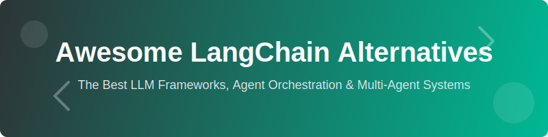

  

  # Awesome LangChain Alternatives 🚀
  
  **The Definitive Guide to LLM Frameworks, Agent Orchestration & Multi-Agent Systems**

  
  
  
  
  

  *Explore the best alternatives to LangChain for building production-grade AI agents, RAG pipelines, and LLM-powered applications.*

---

## 🌟 Overview

**Awesome LangChain Alternatives** is a curated, high-quality list of **SaaS platforms** and **Open-Source GitHub projects** for building state-of-the-art LLM applications. Whether you are looking for more control, better observability, or TypeScript-native support, this repository tracks the industry leaders.

### 🎯 Why look for LangChain Alternatives?
- **Control & Transparency**: Many alternatives offer more explicit control over the LLM execution flow.
- **Production Readiness**: Focused on stability, observability, and scalability.
- **Language Native**: Specialized frameworks for Python, JavaScript/TypeScript, Go, and more.
- **Developer Experience**: Improved debugging, typing (Pydantic), and visual orchestration.

---

## 📑 Table of Contents
- [🏢 SaaS Products](#-saas-products)
- [💻 Open-Source GitHub Projects](#-open-source-github-projects)
- [🛠️ How to Contribute](#️-how-to-contribute)
- [⚖️ Disclaimer](#️-disclaimer)
- [📊 Star History](#-star-history)

---

## 🏢 SaaS Products

### 💰 Pricing & Valuation (USD/month)

| Product | 📝 Description | 📈 Company Size / Valuation | 💵 Price (USD/month) | 🎁 Free tier (limit) |
|---|---|---|---:|---|
| [Langflow](https://www.langflow.org/) | Visual IDE for LangChain applications (open-source) | **IBM** (~$170B Market Cap) | Self-host: free; Hosted offerings: contact providers | Self-host: free |
| [Flowise](https://flowiseai.com/) | Low-code visual flow builder — open-source and hosted options | **Workday** (~$75B Market Cap) | Hosted: contact Flowise / login for pricing; Self-host: free | Self-host: free (open-source) |
| [LangChain](https://www.langchain.com/) (LangChain Cloud / LangSmith) | Cloud platform for observability, deployment, and agent orchestration | **$1.25B** (Valuation) | Free: 1 seat; Team add-on $39/seat/mo; metered usage for traces, deployments, and engines | Free: 1 seat; 5k base traces/mo included; 1 free Dev deployment |
| [LangGraph](https://www.langchain.com/langgraph) | Stateful, graph-based extension of LangChain | **$1.25B** (LangChain Inc.) | Hosted via LangChain Cloud — see LangChain pricing; Self-host: free | Self-host: free; Hosted: follows LangChain Cloud free tier |
| Mastra (hosted) | Modern agent platform with enterprise support | **$35.5M** (Funding) | Contact sales / custom pricing | Open-source framework: free to self-host |
| PydanticAI (cloud features) | Type-safe LLM integrations and cloud features | **$17.2M** (Funding) | Contact sales / custom pricing | Core libraries: free (open-source) |

*(Notes: Pricing details vary by usage — model/LLM costs, trace volumes, compute, and seats. Refer to the vendor pricing pages linked above.)*

### ⚡ Advanced Platforms
**Other notable mentions**: Microsoft Semantic Kernel, PydanticAI cloud features, and Mastra hosted solutions.

---

## 💻 Open-Source GitHub Projects

### 🛠️ Dedicated Agent Orchestration & LLM Frameworks

- **[LangChain](https://github.com/langchain-ai/langchain)** 🐍  
  The foundational Python/JS framework for building context-aware LLM applications with chains, agents, memory, and extensive tool integrations.

- **[LangGraph](https://github.com/langchain-ai/langgraph)** 🕸️  
  Production-grade library for building stateful, controllable multi-actor applications with cycles, persistence, and human-in-the-loop capabilities.

- **[CrewAI](https://github.com/crewAIInc/crewAI)** 👥  
  Role-based multi-agent orchestration framework. Extremely popular for building collaborative agent teams with clear roles and goals.

- **[Microsoft AutoGen](https://github.com/microsoft/autogen)** 🤖  
  Multi-agent conversation framework that enables complex, dynamic interactions between multiple LLM agents.

- **[Flowise](https://github.com/FlowiseAI/Flowise)** 🎨  
  Open-source low-code tool for building LLM workflows visually. Great for rapid prototyping and non-coders.

- **[Langflow](https://github.com/langflow-ai/langflow)** 🛠️  
  Open-source visual IDE for building and deploying LangChain applications with drag-and-drop components.

- **[PydanticAI](https://github.com/pydantic/pydantic-ai)** ✅  
  Lightweight, type-safe framework for building structured LLM applications with strong validation and Pydantic integration.

- **[Mastra](https://github.com/mastra-ai/mastra)** 🚀  
  Modern framework for building production AI agents with excellent developer experience and observability.

- **[LlamaIndex](https://github.com/run-llama/llama_index)** 🗂️  
  Powerful data framework for RAG and agent applications with deep indexing and query capabilities.

### 🔗 Additional Strong Open-Source Options

- **[Semantic Kernel](https://github.com/microsoft/semantic-kernel)** — Microsoft’s orchestration framework with plugins and planners.
- **[Haystack](https://github.com/deepset-ai/haystack)** — Production-ready RAG and agent framework.
- **[DSPy](https://github.com/stanfordnlp/dspy)** — Programming (not prompting) framework for optimizing LLM pipelines.
- **[AutoGen Studio](https://github.com/microsoft/autogen)** — Visual interface for AutoGen.
- **[Phidata / Agno](https://github.com/phidatahq/phidata)** — Framework for building agents with memory, knowledge, and tools.
- **[Camel-AI](https://github.com/camel-ai/camel)** — Communicative agents for multi-agent research.
- **[MetaGPT](https://github.com/geekan/MetaGPT)** — Multi-agent framework simulating software companies.

> **Pro Tip**: Combine **LangGraph** + **CrewAI** + **LlamaIndex** with **Ollama** / **vLLM** for fully local, production-grade agent systems.

---

## 🛠️ How to Contribute

We love contributions! Help us keep this list up-to-date.

1. 🍴 Fork the repo.
2. 📝 Add/edit entries in `README.md` (follow existing format).
3. 🔗 Include: name, link, 1–2 sentence description, and whether it's SaaS or open-source.
4. 🚀 Submit PR with a short explanation.

**Star the repo if you find it useful!** ⭐

---

## ⚖️ Disclaimer

- This is a **community-curated** list — not exhaustive and not an endorsement.
- Framework choice depends heavily on your specific use case.
- Always review licensing and security implications.

---

## 📊 Star History

	<a href="https://www.star-history.com/?repos=ishandutta2007%2FAwesome-LangChain-Alternatives&type=date&legend=bottom-right">
	 <picture>
	   <source media="(prefers-color-scheme: dark)" srcset="https://api.star-history.com/chart?repos=ishandutta2007/Awesome-LangChain-Alternatives&type=date&theme=dark&legend=bottom-right" />
	   <source media="(prefers-color-scheme: light)" srcset="https://api.star-history.com/chart?repos=ishandutta2007/Awesome-LangChain-Alternatives&type=date&legend=bottom-right" />
	   
	 </picture>
	</a>

---

  <b>Made for AI developers, LLM engineers, and agent builders.</b> 
  Let's make powerful LLM applications more composable, controllable, and open.

